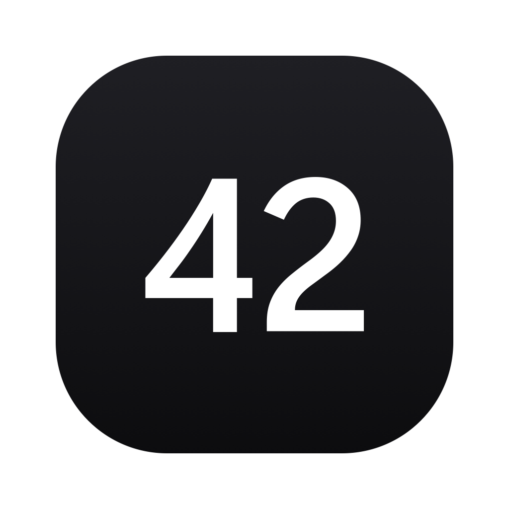

# Terminal 42

An AI-powered terminal and design studio built on Electron.

Terminal 42 wraps the GitHub Copilot CLI with a full desktop experience — terminal sessions, a design workspace with live canvas, brain/memory system, activity dashboard, and more.



## Features

- **Terminal** — Full xterm.js terminal with Copilot CLI integration, search (⌘F), zoom (⌘+/⌘-), customizable fonts and cursor
- **Design Studio** — Create, import, and iterate on web designs with AI. Canvas preview, brain check, annotate, edit, export to Figma
- **Brain** — Persistent memory for your preferences, rules, and project context. Applied automatically or on demand
- **Activity** — Dashboard tracking sessions, designs, tasks, and token usage
- **Import** — Open existing projects from local folders or clone from Git
- **Model Picker** — Switch between Anthropic (Claude) and OpenAI (GPT) models

## Install

### Download

Grab the latest release from the [Releases page](https://github.com/akwasijr/terminal42/releases):

- **Mac** — `Terminal42-x.x.x-arm64.dmg`
- **Windows** — `Terminal42-Setup-x.x.x.exe`

### Mac — fix "damaged" warning

macOS Gatekeeper blocks unsigned apps. After installing, open Terminal and run:

```bash
xattr -cr /Applications/Terminal42.app
```

Then open the app normally.

### Prerequisites

- [GitHub Copilot CLI](https://docs.github.com/en/copilot/github-copilot-in-the-cli) installed and authenticated
- [GitHub CLI](https://cli.github.com/) (`gh`) for Git import and GitHub features
- Node.js 20+ (for development only)

## Development

```bash
# Install dependencies
npm install

# Run in dev mode
npm run dev

# Build for production
npm run build

# Package for your platform
npm run package:mac    # Mac DMG + ZIP
npm run package:win    # Windows NSIS installer
npm run package:linux  # Linux AppImage
```

## Tech Stack

- **Electron 39** (Chromium 142, Node 22)
- **React 18** + TypeScript
- **Vite** (via electron-vite)
- **xterm.js** with search addon
- **Tailwind CSS**
- **better-sqlite3** for local storage
- **node-pty** for terminal sessions

## License

MIT
